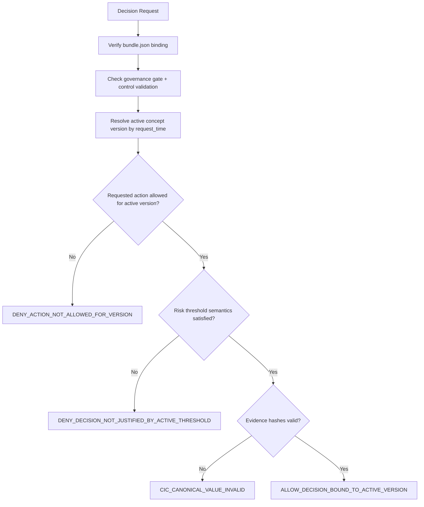

# Benefit Allocation Risk Evolution Demo Pack

Non-normative public demo pack for governance-bound concept evolution in benefit allocation decisions.

## Why This Exists

This pack operationalizes a common governance pattern:

1. A concept evolves (`HighRiskApplicant v1.0 -> v1.1`).
2. Thresholds and mitigation logic change due to ontological drift.
3. Decisions must bind to the active concept version at decision time.
4. Governance gate and control validation must pass before execution.

## Core Guarantees

The system can prove:

1. Governance gate was satisfied.
2. Control validation proof exists.
3. Decision used the active concept version for the request timestamp.
4. Requested action is allowed for that active version.
5. Decision outcome is consistent with active threshold semantics.
6. Evidence hashes were recorded.

If any check fails, the decision is denied with a deterministic reason code.

## Scenario

1. `high_risk_applicant.v1.0` is active initially.
2. Drift and strategic discovery trigger evolution to `high_risk_applicant.v1.1`.
3. New thresholds are stricter and mitigation logic changes.
4. Decision events after the cutover must use `v1.1`; stale `v1.0` decisions are denied.

## Why This Helps

1. Proves replayability: an auditor can reconstruct why a decision passed or failed at that timestamp.
2. Prevents silent policy drift: old concept semantics cannot be used after a controlled cutover.
3. Forces bounded execution: out-of-scope intents and unapproved actions fail closed.
4. Produces evidence-ready outputs: hash-linked decision evidence is required for allow paths.

## Included Artifacts

1. `concept-versions.json`: active windows, thresholds, and allowed actions per concept version.
2. `decision-space.json`: deterministic allow/deny matrix and reason codes.
3. `evidence-template.json`: minimum hash-link fields for decision traceability.
4. `bundle.json` and `obt.jws`: signed-style manifest and token artifacts for pack binding.

## Decision Flow



Transition and retrieval strategy details:

1. [Benefit Allocation Risk Evolution Pattern](../../docs/architecture/benefit-allocation-risk-evolution-pattern.md)

## Run Fixtures

From repository root:

```bash
node tools/run-benefit-allocation-risk-evolution-fixtures.mjs
```

Fixture index:

1. `fixtures/benefit-allocation-risk-evolution/index.json`

## Status

1. Public candidate demo pack for interoperability and governance review.
2. Synthetic governance scenario; not legal advice or production policy text.
